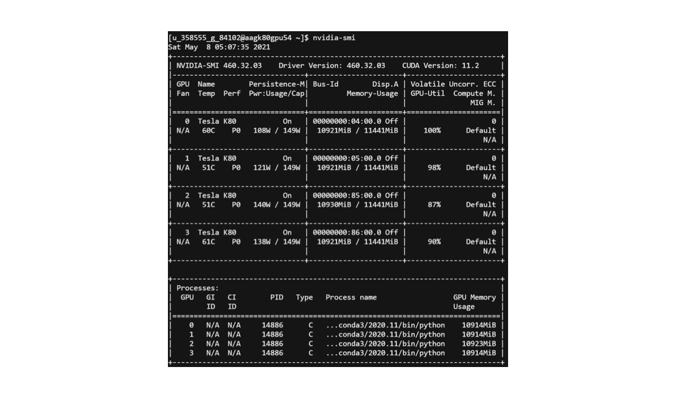

# How to Run

<p align="justify"> In order to reproduce our results and run our code, one first needs to connect to <a href="https://www.rc.fas.harvard.edu/">FAS On Demand</a>. Them, in our team’s project location (cd /n/holyscratch01/Academic-cluster/Spring_2021/g_84102/SCRATCH/ImageNet/), which we rendered it public for everyone to see our code and be able to run the code.  </p>

Load the conda module with python >= 3.7 (otherwise the compatibility of tensorflow datasets 2.4 breaks the code):
```
module load python/3.8.5-fasrc01
```
Create a conda environment with the right packages:
```
conda create -n python3
source activate python3
pip install -r requirements.txt
```
Load Cuda and Cudnn:
```
module load cuda/11.0.3-fasrc01
module load cudnn/8.0.4.30_cuda11.0-fasrc01
```

Allocate a session with 4 GPUs, on the gpu partition, with 100GB and 10 hours:
```
salloc -t 600 --mem=100G -p gpu --exclusive --gres=gpu:4
```

Sanity check: one should be able to run python test_gpu.py and get as output

### Install Spark

Load java module:

```
module load jdk/1.8.0_45-fasrc01
```

Download Spark 3.1.1:
```
curl -O https://archive.apache.org/dist/spark/spark-3.1.1/spark-3.1.1-bin-hadoop3.2.tgz
tar xvf spark-3.1.1-bin-hadoop3.2.tgz
vim ~/.bashrc
```
Add the following lines: 

```
SPARK_HOME=/n/holyscratch01/Academic-cluster/Spring_2021/g_84102/SCRATCH/ImageNet/spark
export PATH=$PATH:$SPARK_HOME/bin:$SPARK_HOME/sbin
```
Check that it’s working:
```
pyspark
```
The output should look like this:


### Install Spark-Tensorflow Connector

Clone the Spark Tensorflow Repository
```
git clone https://github.com/tensorflow/ecosystem.git
```

Install <a href="https://maven.apache.org/">maven</a> for Hadoop
```
wget https://www-eu.apache.org/dist/maven/maven-3/3.6.3/binaries/
tar xf apache-maven-3.8.1.tar.gz
mv apache-maven-3.8.1 maven
```
Update your environment variables:

```
vim ~/.bashrc
```

Add the lines:
```
export M2_HOME=/n/holyscratch01/Academic-cluster/Spring_2021/g_84102/SCRATCH/ImageNet/maven
export MAVEN_HOME=/n/holyscratch01/Academic-cluster/Spring_2021/g_84102/SCRATCH/ImageNet/maven
export PATH=${M2_HOME}/bin:${PATH}
```

Activate the Changes:
```
source ~/.bashrc
```

Sanity check: 
```
mvn -version
```
Your output should be:


## Download MobileNet 

Here are the links that have been used to download the ImageNet dataset:

- Train images : http://image-net.org/data/ILSVRC/2012/ILSVRC2012_img_train.tar 
- Train images : http://image-net.org/data/ILSVRC/2012/ILSVRC2012_img_train_t3.tar 
- Validation images: http://image-net.org/data/ILSVRC/2012/ILSVRC2012_img_val.tar 
- Test images: http://image-net.org/data/ILSVRC/2012/ILSVRC2012_img_test_v10102019.tar  
- Development kit : http://image-net.org/data/ILSVRC/2012/ILSVRC2012_devkit_t12.tar.gz 
- Development kit : http://image-net.org/data/ILSVRC/2012/ILSVRC2012_devkit_t3.tar.gz 


## How to train the initial MobileNet on ImageNet

Create a <a href="https://wandb.ai/home">wandb</a> account in order to visualize training log

Run the bash training script:
```
sbatch run_script.sh 
```

In order to check that the work if effectively being parallelized across the 4 GPUs, open a new shell (one needs to be in login mode)

```
squeue -u $USER
```


```
ssh to the node (here it is ssh aagk80gpu55)
nvidia-smi -l 1 (dynamic visualization of the occupation of the 4 GPUs)
```

The output should look like:



<p align="justify">  This output shows that the parallelization is successful, our bottleneck for the in the data pipeline with the CPU feeding the GPU has been resolved (we have now 90% util capacity of every 4 GPUs) and we are allocating the memory of the GPU in the right way since with every bus its memory its nearly saturated (we need to use batch size of $2^k$ so switching to the next batch size produces OOM error).  </p>

Once the initial run is done ( you can activate Slack notifications in wandb) https://docs.wandb.ai/ref/app/features/alerts you will be able to launch the IMP training using:
```
sbatch SLURM.sh
```
In order to check that you have effective parallelization across different nodes:

```
Nvidia-smi -l 1
```

Last, we logged the results and the configuration (mask & late resetting epoch) using wandb and selected the best model. 

