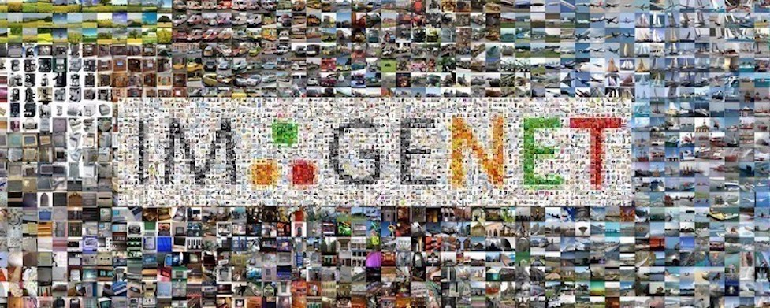

# Why ImageNet ? 

For the winning tickets to be effective, we need them to contain generic inductive biases. When we train and prune a neural network to get a winning ticket, it is not only for the specific dataset we are dealing with, but we do it broadly to get one winning ticket working for different datasets to avoid training and pruning our neural network everytime we change the settings of our problem. The bigger the dataset the more general the winning ticket we find. This is why we chose to use ImageNet.

# Data

We downloaded the Imagenet dataset using the following links:

- Train images :  
     - http://image-net.org/data/ILSVRC/2012/ILSVRC2012_img_train.tar & 
     - http://image-net.org/data/ILSVRC/2012/ILSVRC2012_img_train_t3.tar 
- Validation images: http://image-net.org/data/ILSVRC/2012/ILSVRC2012_img_val.tar 
- Test images: http://image-net.org/data/ILSVRC/2012/ILSVRC2012_img_test_v10102019.tar  
- Development kits: 
     - http://image-net.org/data/ILSVRC/2012/ILSVRC2012_devkit_t12.tar.gz & 
     - http://image-net.org/data/ILSVRC/2012/ILSVRC2012_devkit_t3.tar.gz 

Finally, the label correspondence is given with https://gist.github.com/yrevar/942d3a0ac09ec9e5eb3a.

## Characteristics

Here are some characteristic of the dataset:
- Total number of training images: 1.23M  
- Total number of validation images: 100k
- Total number of test images: 50k
- Size: 157.3 GB
- Average image resolution (downloaded): 469x387 
- Average image resolution (preprocessed): 227x227

 Our problem falls under the Big Data paradigm and we need to leverage Spark in order to deal with this amount of data. We could leverage Spark in two different ways: in an offline manner in order to reduce the amount of online data pipeline needed to feed the model, or using Elephas for Spark in order to increase the number of workers attaining the GPU. As we will see later, we will only use the former, because we already reach 100% occupation of the GPUs.  Just to get a sense of how large ImageNet is, when the fine tuned model ResNet50 runs over the dataset on 8 GPUs (p3.16xlarge instance on AWS), it takes nearly 9 hours to reach a 73% top 5 accuracy on the data. This is why we need to use Spark for our offline operations, in addition to training our model on 4 GPUs. 

