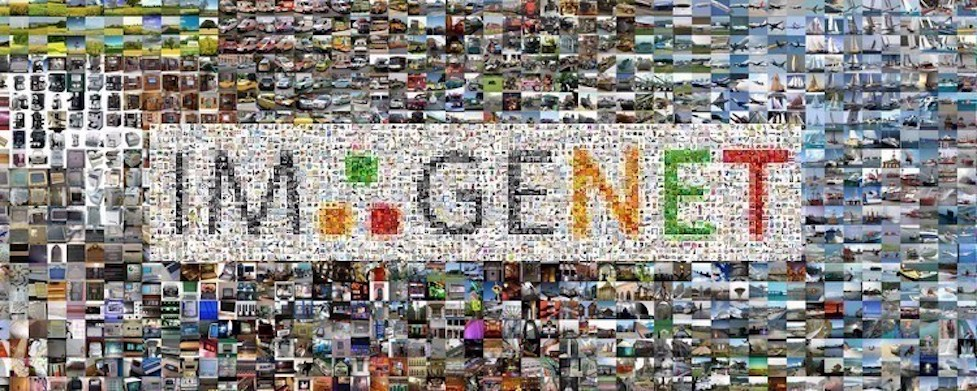

# Data

We downloaded the Imagenet dataset using the following links:

- Train images :  
     - http://image-net.org/data/ILSVRC/2012/ILSVRC2012_img_train.tar & 
     - http://image-net.org/data/ILSVRC/2012/ILSVRC2012_img_train_t3.tar 
- Validation images: http://image-net.org/data/ILSVRC/2012/ILSVRC2012_img_val.tar 
- Test images: http://image-net.org/data/ILSVRC/2012/ILSVRC2012_img_test_v10102019.tar  
- Development kits: 
     - http://image-net.org/data/ILSVRC/2012/ILSVRC2012_devkit_t12.tar.gz & 
     - http://image-net.org/data/ILSVRC/2012/ILSVRC2012_devkit_t3.tar.gz 

Finally, the label correpsondence is given with https://gist.github.com/yrevar/942d3a0ac09ec9e5eb3a.

## Characteristics

Here are some characteristic of the dataset:
- Total number of training images: 1.23M  
- Total number of validation images: 100k
- Total number of test images: 50k
- Size: 157.3 GB
- Average image resolution (downloaded): 469x387 
- Average image resolution (preprocessed): 227x227

Our problem falls under the Big Data kind and we need to leverage Spark in order to deal with this amount of data.
