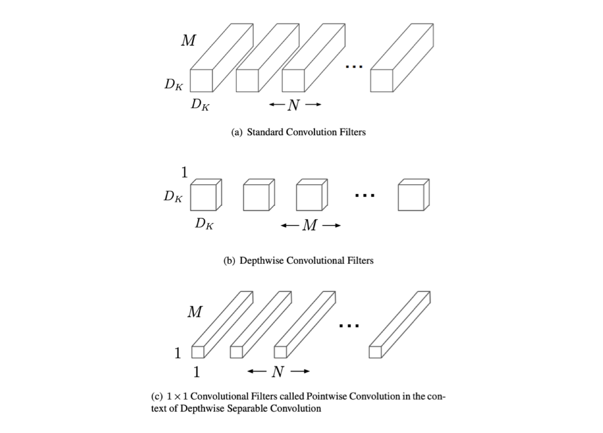

# MobileNet and MobileNetV2 Architectures

## MobileNet

We first examine the paper [MobileNets: Efficient Convolutional Neural Networks for Mobile Vision Applications](https://arxiv.org/abs/1704.04861). The objectives of the author is to make neural networks much lighter, with an eye on deployement on mobiles and embedded vision applications, without compromising on accuracy.

### Depthwise separable convolutions
 
The key idea behind MobileNets are depthwise separable convolutions.

In a regular convolution, we apply a filter a $D_K$ into $D_K$ into $M$ filter. 

