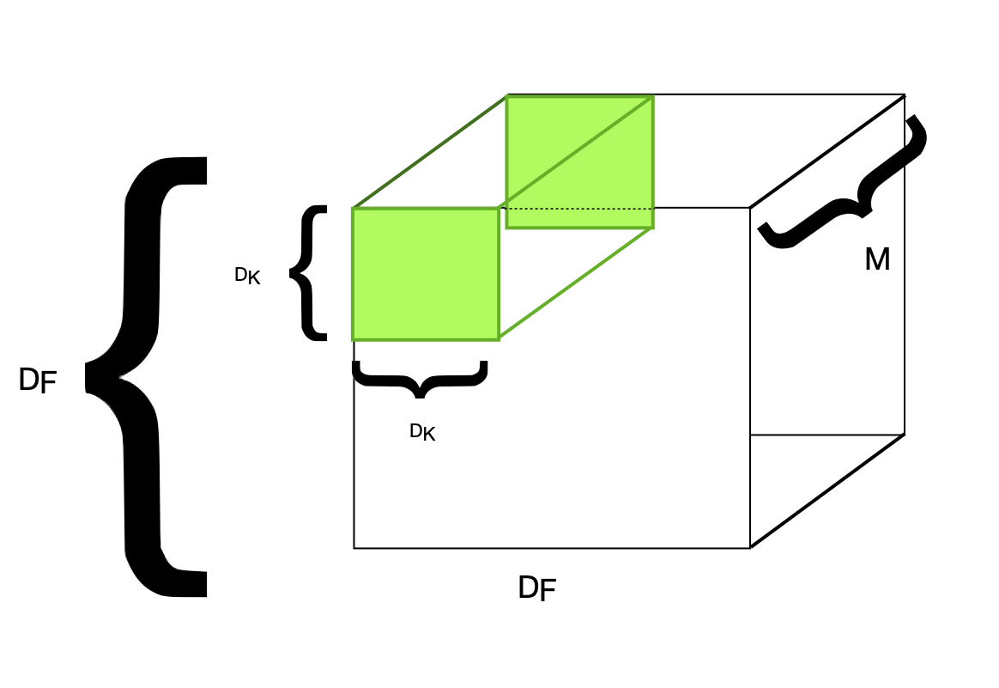

# MobileNet and MobileNetV2 Architectures

## MobileNet

 We first examine the paper [MobileNets: Efficient Convolutional Neural Networks for Mobile Vision Applications](https://arxiv.org/abs/1704.04861). The objectives of the author is to make neural networks much lighter, with an eye on deployement on mobiles and embedded vision applications, without compromising on accuracy. 

### Depthwise separable convolutions
 

 The key idea behind MobileNets are depthwise separable convolutions. 

 In a regular convolution, we apply a filter a DK by DK by M filter. So we look for relationships within each channel (DK by DK) and between channels. 

 The goal of depthwise seprable convolutions is to break down this process into two parts: first, we look for relationships within each channel, and then between different channels. This is illustrated below in figures b) and c). We first take DK by DK filters and apply them one each to a channel. We thus have M such filers, called depthwise convolutions. In image c), we can see the pointwise convolutions: those are 1 by 1 by M convolutions. 

 The cost of a regular convolution is  DK  DK M. If we do N such convolutions, the cost is DK  DK M N. Finally, if we apply this to our block of size DF by   DF, with stride one, we get a cost of DK  DK M N  DF  DF. 

