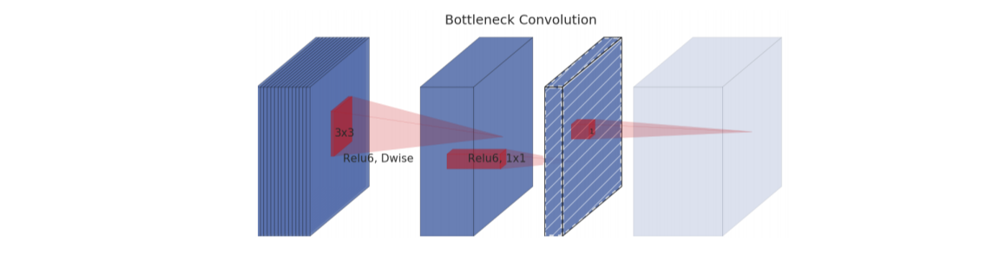

# MobileNet and MobileNetV2 Architectures

## MobileNet

 We first examine the paper <a href="https://arxiv.org/abs/1704.04861">MobileNets: Efficient Convolutional Neural Networks for Mobile Vision Applications</a>. The objectives of the author is to make neural networks much lighter, with an eye on deployement on mobiles and embedded vision applications, without compromising on accuracy. 

### Depthwise separable convolutions
 

 The key idea behind MobileNets are depthwise separable convolutions. 

  First, here is an image for a standard convolution. 

 In a regular convolution, we apply a filter a DK by DK by M filter. So we look for relationships within each channel (DK by DK) and between channels. 

 The goal of depthwise seprable convolutions is to break down this process into two parts: first, we look for relationships within each channel, and then between different channels. This is illustrated below in figures b) and c). We first take DK by DK filters and apply them one each to a channel. We thus have M such filers, called depthwise convolutions. In image c), we can see the pointwise convolutions: those are 1 by 1 by M convolutions. 

 The cost of a regular convolution is  DK  DK M. If we do N such convolutions, the cost is DK  DK M N. Finally, if we apply this to our block of size DF by   DF, with stride one, we get a cost of DK  DK M N  DF  DF. 

 For depthwise separable convolutions, we first consider the cost of the depthwise convolutions. The cost of one such convolution is DK DK. We do M such convolution (see b)) and using a stride one. The cost is then DK DK M DF DF. For the pointwise convolutions, the cost of just one convolution is M. We do N such convolutions, with a stride of one, for a cost of M N DF DF. 

 Thus the total depthwise convolutions cost is DK DK M DF DF+ M N DF DF. 

The ratio between the cost of a depthwise separable convolution and a classical convolution is thus (1/N)+(1/(DK DK)).

We can add a width multiplyier. We introduce a parameter &alpha;. The cost become DK DK &alpha M DF DF+ &alpha; M &alpha; N DF DF

Here is a nice vizualisation of the difference between classical convolutions and depthwise separable convolutions:

**Standard convolution:**

**Depthwise Convolution and Pointwise Convolution:**

Source of the images: 
- https://machinethink.net/blog/googles-mobile-net-architecture-on-iphone/
- https://arxiv.org/abs/1704.04861

## MobileNetV2

 The first architecture was updated with <a href="https://arxiv.org/abs/1801.04381">MobileNetV2: Inverted Residuals and Linear Bottlenecks</a> by Mark Sandler, Andrew Howard, Menglong Zhu, Andrey Zhmoginov, Liang-Chieh Chen. The network design is based on MobileNetV1 and significantly improves its accuracy. The main contribution of MobileNetV2 is a novel layer module: the inverted residual with linear bottleneck. 

Here is the illustrations for standard convolutions and depthwise separable convolutions used in the paper:

 The concepts of bottleneck convolutions and expansion convolutions are illustrated below. The diagonally hatched block do not contain
non-linearities. The lightly colored block indicates the beginning of the next block. 

Source of the images: 
- <a href="https://arxiv.org/abs/1801.04381">MobileNetV2: Inverted Residuals and Linear Bottlenecks</a>

### MobileNetV3

Note that there are even more recent models by Google (for instance <a href="https://arxiv.org/abs/1905.02244">Searching for MobileNetV3</a> by Andrew Howard, Mark Sandler, Grace Chu, Liang-Chieh Chen, Bo Chen, Mingxing Tan, Weijun Wang, Yukun Zhu, Ruoming Pang, Vijay Vasudevan, Quoc V. Le, Hartwig Adam).

