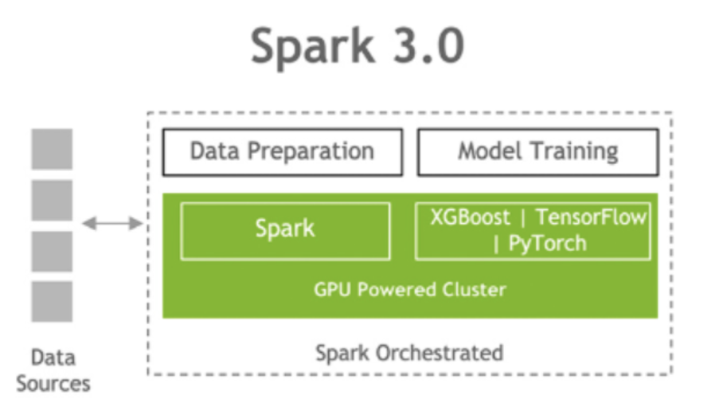
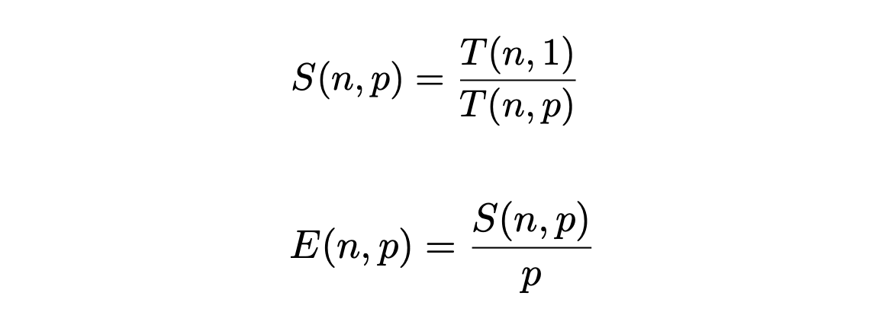

# Problem

## Need for Big Compute

**MobileNetV2 Architecture**: 
- Total number of parameters: 3.4M 
- Number of multiply-adds (MAdds) per forward pass: 300M
- **Solution**: GPU Accelerated Computing (4 GPUs single worker node)

**Two Nested For Loops to Find the Lottery Ticket Hypothesis**
- Outer for loop: iterate over different masks (pruning thresholds)
- Inner for loop: iterate over the range of late resetting epochs
- Train a sparse MobileNetV2 CNN per each inner loop iteration
- **Solution**: SLURM: Distributed Computing (20 worker nodes)

## Need for Big Data

 We are dealing with a Big Data problem because of the size of our dataset. We do not consider Velocity or Variety (we have all of our data available at once, and we are only delaing with images). However, one can imagine that lottery tickets found on ImageNet could be used on a variety of tasks that use convolution operations (computer vision, speech recognition...). 
 

ImageNet Dataset: 
- Total number of training images: 1.23M  
- Total number of validation images: 100k
- Total number of test images: 50k
- ImageNet Dataset size: 157.3 GB
- Average image resolution (downloaded): 469x387
- Average image resolution (preprocessed): 227x227
- **Solution**: PySpark API Dataflow Parallelization (download and process ImageNet)
- **Solution**: Performance Optimization (caching, prefetching)
- **Solution**: Keras Extension Elephas Data-parallel Training
- **Velocity**: Not considered in our project 
- **Variety**: Not considered in our project

## Programming model and infrastructure

Python 3.8.5, mpi4py 3.0.3, pyspark 3.1.1, Apache maven 3.8.1, java 1.8.0_45
We used Spark-Tensorflow connector and Standalone Spark mode to convert the data from TF Tensors to RDD and process it in an offline manner
We use SLURM Job Arrays for communication between our nodes and Python Multiprocessing for parallelization within a node 
Train using TensorFlow 2.0 (leveraging cuda and cudnn) 
Objective: End solution comprises 20 worker nodes, each one will have 4 GPUs TESLA K80 with 11.5 GB memory and 64 CPUs 

- We use FAS RC (take advantage of the SCRATCH space [300+GB] and the ease of allocating several nodes for MPI). 
- Python 3.8.5, mpi4py 3.0.3, pyspark 3.1.1
- We used Spark to download the data [working closely with FAS in order to devise the right SLURM allocations for the different workers to access the GPUs safely]

- We use MPI for communication between our nodes and Python Multiprocessing for parallelization within a node. We allocate jobs to different nodes and then on every node, we use Spark 
- Train using TensorFlow 2.0 (leveraging cuda and cudnn) and <a href="https://github.com/maxpumperla/elephas">Elephas</a> (PySpark module) in order to accelerate batch training 
- Objective: End solution comprises 20 worker nodes, each one will have 4 GPUs TESLA K80 with 11.5 GB memory and 64 CPUs 

## Numerical Complexity

The numerical complexity of doing late-resetting and masking is O(MNt). 

- M is the number of thresholds for our masks (each mask gives us one subnetwork)
- N is the length of the trellis for late resetting  
- t is the average time to train a network (we actually use sparse subnetworks, so we expect them to train faster than the original one).

### Theoretical Speed-up & Expected Scalability

 In our case, the numerical complexity of doing late-resetting and masking is O(100t). 

- We take M = 20. We have 20 sparse subnetworks.
- We take N = 5. We do 5 resetting of the weights
- We estimate t at 26 h 15 min without worker parallelization. 

 Thus, the expected time in order to run all the sparser substructures from the different epochs is 
2625 hours without worker parallelization. 

 We use 20 worker nodes. Each worker needs to do several late resetting for the particular structure found after masking. Afterwards, there is no communication between the worker nodes. The communication time at the beginning is negligible compared to training time. The computation time per epoch is 4.5 minutes at best. We have 350 epochs, and perform 5 late resetting. Thus we achieve a run time of 131 h 15 min at best per worker node. This corresponds to a speed up of 20. 
 

### Amdahl Law (1967)

Parallel execution Speed-up and Efficiency for a given problem size and a number of processors are given by:

In our case S=20 and E=1.

