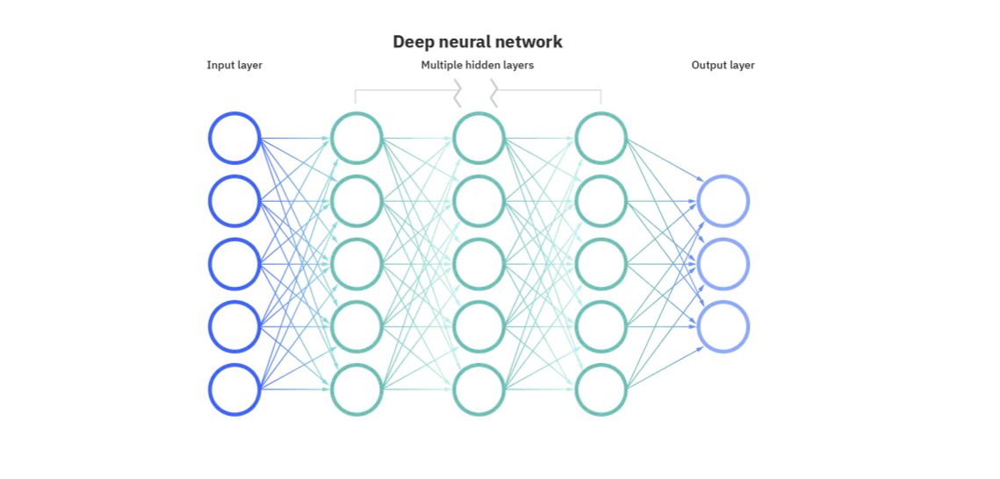
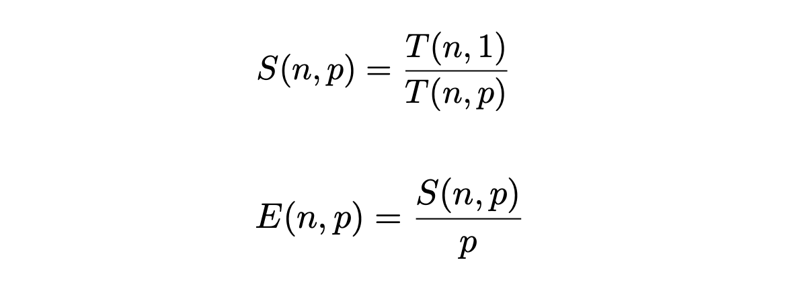
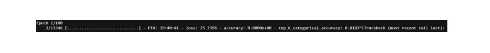
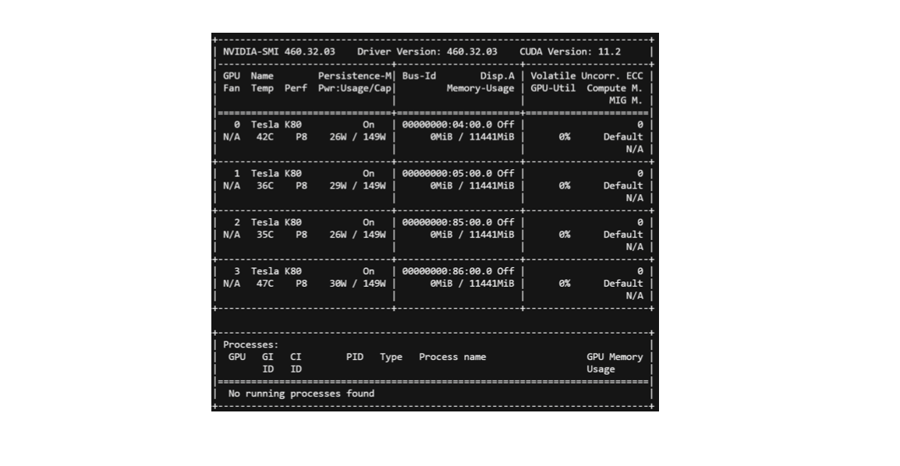
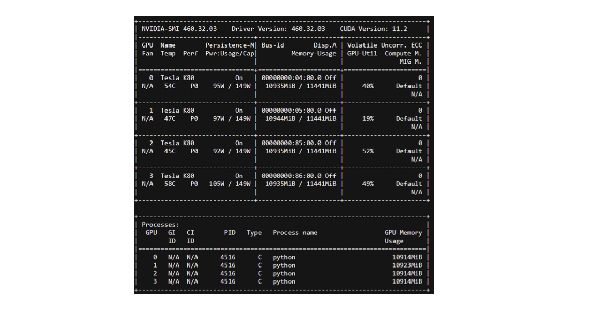

# Problem

## Basics of NN

For those unfamiliar with deep learning, here are some terms we will be using throughout our writeup.

 A neural network is composed of multiple layers, including an input layer and an output layer. Layers are themselves composed of nodes. The node of the input layer in a computer vision application correpsond to pixel values. The output layer can either correspond to a one-hot-encoding of labels, or to a vector whose entries are between 0 and 1 and sum to one (when we use the softmax activation function). 
 

Source of the image: https://www.ibm.com/cloud/learn/neural-networks

## Need for Big Data

 We are dealing with a Big Data problem because of the size of our dataset. We do not consider Velocity or Variety (we have all of our data available at onece, and we are only delaing with images). However, one can imagine that lottery tickets found on Imagenet coukd be used on a variety of tasks that use convolutions (computer vision, speech recognition...). 
 

- **Volume**: 
     -  1.23M training images
- **Velocity**: Not considered in our project 
- **Variety**: Not considered in our project

## Numerical complexity

The numerical complexity of doing late-resetting and masking is O(MNt). 

- M is the number of thresholds for our masks (each mask gives us one subnetwork)
- N is the length of the trellis for late resetting  
- t is the average time to train a network (we actually use sparse subnetworks, so they train faster than the original one).

### Theoretical Speed up & expected scalability

 In our case, the numerical complexity of doing late-resetting and masking is O(100t). 

- We take M = 20. We have 20 sparse subnetworks.
- We take N = 5. We do 5 resetting of the weights
- We estimate t at 26 h 15 min without worker parallelization. 

 Thus, the expected time in order to run all the sparser substructures from the different epochs is 
2625 hours without worker parallelization. 

 We use 20 worker nodes. Each worker needs to do several late resetting for the particular structure found after masking. Afterwards, there is no communication between the worker nodes. The communication time at the beginning is negligible compared to training time. The computation time per epoch is 4.5 minutes at best. We have 350 epochs, and perform 5 late resetting. Thus we achieve a run time of 131 h 15 min at best per worker node. This corresponds to a speed up of 20. 
 

#### Amdahl Law (1967)

Parallel execution Speed-up and Efficiency for a given problem size and a number of processors are given by:

In our case S=20 and E=1.

## CPU and GPU training

We bring down the time with GPUs:

## GPU occupancy

" A CUDA device's hardware implementation groups adjacent threads within a block into warps. A warp is active from the time its threads begin executing to the time when all threads in the warp have exited from the kernel. Occupancy is the ratio of active warps on an SM to the maximum number of active warps supported by the SM. Occupancy varies over time as warps begin and end, and can be different for each SM. "

Low occupancy results in poor instruction issue efficiency, because there are not enough eligible warps to hide latency between dependent instructions. When occupancy is at a sufficient level to hide latency

Source: https://docs.nvidia.com/gameworks/content/developertools/desktop/analysis/report/cudaexperiments/kernellevel/achievedoccupancy.htm

We manage to increase the GPU occupancy.

We see that initially, the occupancy is 0%. We manage to increase this:

Finally, we were able to reach 100% GPU occupancy.

## Spark for offline processing of the data

We reshaped the data as tf tensors before loading it. 

