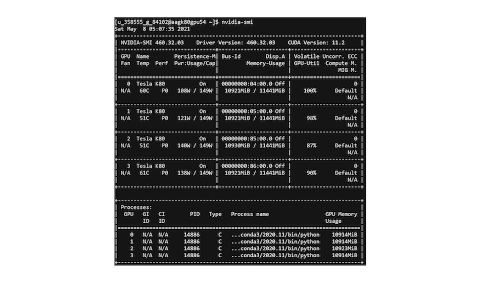

# Problem

## Need for Big Compute

**MobileNetV2 Architecture**: 
- Total number of parameters: 3.4M 
- Number of multiply-adds (MAdds) per forward pass: 300M

**Two Nested For Loops to Find the Lottery Ticket Hypothesis**
- Outer for loop: iterate over different masks (pruning thresholds)
- Inner for loop: iterate over the range of late resetting epochs
     - Train a sparse MobileNetV2 CNN per each inner loop iteration

## Need for Big Data

<p align="justify"> We are dealing with a Big Data problem because of the size of our dataset. We do not consider Velocity or Variety (we have all of our data available at once, and we are only delaing with images). However, one can imagine that lottery tickets found on Imagenet coukd be used on a variety of tasks that use convolutions (computer vision, speech recognition...). </p> 

- **Volume**: 
     -  1.23M training images
- **Velocity**: Not considered in our project 
- **Variety**: Not considered in our project

## Numerical complexity

The numerical complexity of doing late-resetting and masking is O(MNt). 

- M is the number of thresholds for our masks (each mask gives us one subnetwork)
- N is the length of the trellis for late resetting  
- t is the average time to train a network (we actually use sparse subnetworks, so they train faster than the original one).

### Theoretical Speed up & expected scalability

<p align="justify"> In our case, the numerical complexity of doing late-resetting and masking is O(100t). </p>

- We take M = 20. We have 20 sparse subnetworks.
- We take N = 5. We do 5 resetting of the weights
- We estimate t at 26 h 15 min without worker parallelization. 

<p align="justify"> Thus, the expected time in order to run all the sparser substructures from the different epochs is 
2625 hours without worker parallelization. </p>

<p align="justify"> We use 20 worker nodes. Each worker needs to do several late resetting for the particular structure found after masking. Afterwards, there is no communication between the worker nodes. The communication time at the beginning is negligible compared to training time. The computation time per epoch is 4.5 minutes at best. We have 350 epochs, and perform 5 late resetting. Thus we achieve a run time of 131 h 15 min at best per worker node. This corresponds to a speed up of 20. </p> 

### Amdahl Law (1967)

Parallel execution Speed-up and Efficiency for a given problem size and a number of processors are given by:


In our case S=20 and E=1.

## CPU and GPU training

We use the following link to train on multiple GPUs: https://towardsdatascience.com/train-a-neural-network-on-multi-gpu-with-tensorflow-42fa5f51b8af. 
```
tf.distribute.Strategy
```
is a TensorFlow API to distribute training across multiple GPU. We use the mirrored stratedy which send splits the batches and sends them to the four different GPUs.


We bring down the time with GPUs:


With 4 GPUs and a batch size of 96:


## GPU occupancy

<p align="justify">  " A CUDA device's hardware implementation groups adjacent threads within a block into warps. A warp is active from the time its threads begin executing to the time when all threads in the warp have exited from the kernel. Occupancy is the ratio of active warps on an SM to the maximum number of active warps supported by the SM. Occupancy varies over time as warps begin and end, and can be different for each SM. " </p>

Source: https://docs.nvidia.com/gameworks/content/developertools/desktop/analysis/report/cudaexperiments/kernellevel/achievedoccupancy.htm

### Increasing the GPU occupancy


<p align="justify">  We see that initially, the GPU occupancy is 0%. At this stage, the bottleneck of our architecture was the preprocessing, which prevented our GPUs from efficiently accessing the data. Besides, we couldn't do the batching before the mapping because of the inconsistencies of size in ImageNet. The first step we took to adress this issue was to transform the data to shapes of (64, 64). With image sizes of (64, 64), one epoch runs for 15 mins while for shapes of (224, 224) one epoch took 1h. Need to do some preprocessing here.After resolving the preprocessing issues, we manageed to increase the GPU occupancy: </p>


Finally, we were able to virtually reach 100% GPU occupancy.



## Spark for offline processing of the data

We reshaped the data as tf tensors before loading it. 

