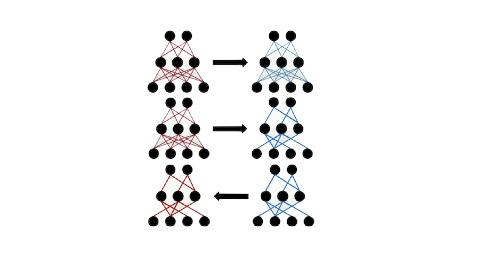

# CS 205 Final Project: The Lottery Ticket Hypothesis (LTH) on FAS RC

## Spring 2021

David Assaraf, Tale Lokvenec, Gaël Ancel, Raphaël Pellegrin

## Overview: the Lottery Ticket Hypothesis (LTH)

 Our project is based on the paper: [The Lottery Ticket Hypothesis: Finding Sparse, Trainable Neural Networks](https://arxiv.org/abs/1803.03635) by Jonathan Frankle and Michael Carbin. The Lottery Ticket Hypothesis (LTH) builds on the notion of network pruning. The idea is to reduce the extent [of a neural network] by removing superfluous or unwanted parts. Network pruning is used to reduce the storage costs and computational requirements of dealing with the network. 

 The basic idea of the LTH is the following. Initially, we begin with a Neural Network where each connection has been set to a random weight. We the train the Neural Network and remove the superfluous structure. Here, we focus on pruning weights: this is called sparse pruning. We look at the magnitude of the weights and we prune the weights with the lowest magnitude. We then reset the remaining weights to their initial value - or to their value at a given epoch - and we retrain the sparse subnetwork. It’s important to reset the weights to their original value or to a value they took during training and not to random values. 

   

Once we have pruned the Neural Network, we have damaged the function that we have learnt. We thus perform some fine tuning (further training).

We then arrive at networks that are 15% to 1% of their original size. Those sub-networks require fewer iterations to learn and they match the accuracy of the original network. 

There is a great talk by Jonathan Frankle at ICLR2019 that summarises these ideas: [J. Frankle & M. Carbin: The Lottery Ticket Hypothesis: Finding Sparse, Trainable Neural Networks](https://www.youtube.com/watch?v=s7DqRZVvRiQ&t=773s)

We have two loops to parallelize: we first need to study different possible thresholds for our masks (a bigger threshold means that we throw away more weights). We also need to decide on the epoch N which we will use as our baseline when we reset the weights of our subnetwork.

## Overview: Need for Big Compute

Firstly, we fit an overparameterized architecture, which ensures tractable non-convex optimization and robustness to corruption. The architecture we chose for the initial Neural Netork is MobileNet Volume 2 by Google, as it drastically reduces the complexity and the network size in comparison to the other state of art CNN architectures. This choice will allow for more efficient algorithm prototyping and testing.

The MobileNet Volume 2 architecture has a total of 3.4 million parameters and 300 million multiply-add operations per single forward pass. As a comparison, another popular CNN architecture, AlexNet has 60 million parameters. Although MobileNet is lighter than most state of art CNN architectures, it is practically infeasible to train it on a single CPU.

To investigate the Lottery Ticket Hypothesis, we use the MobileNetV2 architecture.

- **Number of parameters**: 3.4M 
- **Number of multiply-adds (MAdds) per forward pass**: 300M

Next, we use a pruning algorithm to find effective subnetworks with a much lower parameters count. 

Another - and possibly more prevalent - need for big compute are the two nested for loops present in the pruning algorithm. In the outer loop, the algorithm iterates over the different masks (produced by the different pruning thresholds). In the inner loop, the algorithm iterates over the range of possible epochs which we will use as our baseline when we reset the subnetwork weights. In order to find the Lottery Ticket Hypothesis, we iterate over the grid of threshold values and late resetting epochs and train a sparse version of the MobileNet architecture per each inner loop iteration. In order to parallelize the nested for loops, we use the Big Compute paradigms presented in class.

## Overview: Need for Big Data

For the winning tickets to be effective, we need them to contain generic inductive biases. This means that when we train and prune a neural network to get a winning ticket, the goal is not only to use the winning ticket on the specific dataset we are dealing with, but to also on different datasets. The motivation is to avoid training and pruning our neural network everytime we change the settings of our problem. This idea where presented in the paper [One ticket to win them all: generalizing lottery ticket initializations across datasets and optimizers](https://arxiv.org/abs/1906.02773) by Ari Morcos, Haonan Yu, Michela Paganini and Yuandong Tian.
 
 
The learning transfer is valid for:
- **Same data distribution** (we can for instance split CIFAR-10 half - CIFAR-10a and CIFAR-10b. A winning ticket found for CIFAR-10a work on CIFAR-10b).
- **Different data distribution** (we can find a winning ticket for ImageNet winning and use it on CIFAR-10. Interestingly, an ImageNet ticket might work even better on CIFAR-10 than on ImageNet)

**In general, the bigger the dataset the more general the winning ticket we find will be.**

## Overview: the infrastructure we used

On every node, wedo late resetting from several different epochs and use Python Multiprocessing. The different processes train on four GPU.

In order to download and train our Neural Networks, we useed Spark Elephas that requires data stored as RDDs.

## How to Use

For a complete list of instructions on how to use the programs found in this repository, please see [How To Run]() on the project website. I THINK IT WOULD BE NICE TO DO SOMETHING LIKE THIS TO.

## Table of Contents
1. [Problem Statement](ProblemStatement.md)
2. [Solution](Solution.md)
3. [Model and Data](ModelAndData.md)
4. [MobileNet](MobileNetArchitecture.md)
5. [How To Run](HowToRun.md)
6. [Discussion](Discussion.md)
7. [Replicability](Replicability.md)
