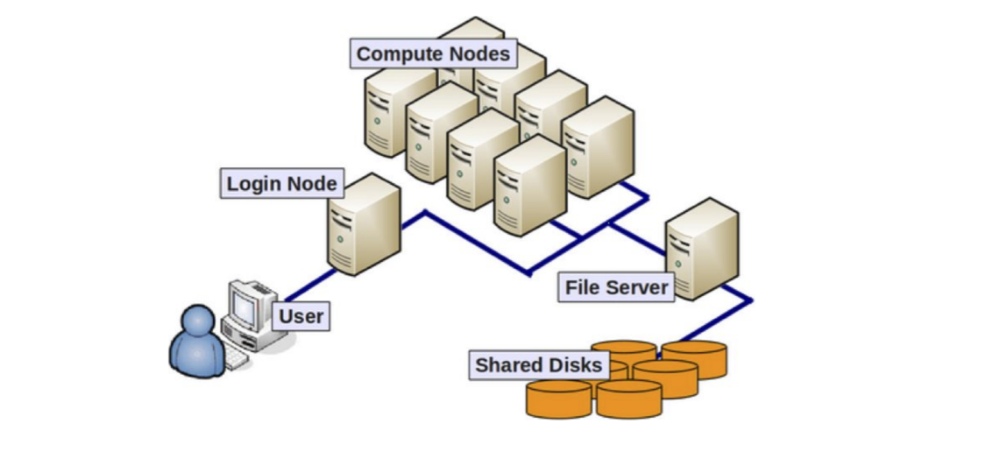
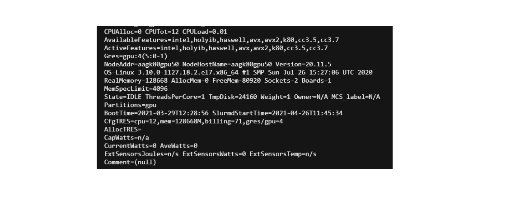
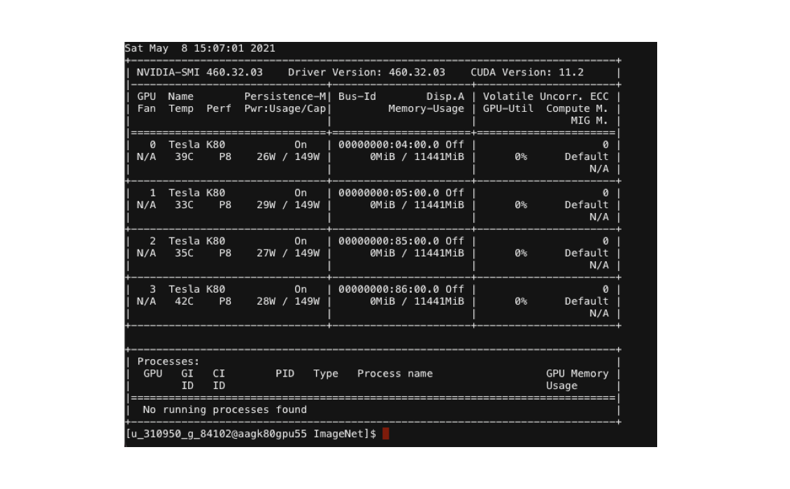

# Replicability

Replicability information. 



## For login node:

The following information is obtained by using:

```
lscpu
```


- Architecture:          x86_64
- CPU op-mode(s):        32-bit, 64-bit
- Byte Order:            Little Endian
- CPU(s):                64
- On-line CPU(s) list:   0-63
- Thread(s) per core:    2
- Core(s) per socket:    8
- Socket(s):             4
- NUMA node(s):          8
- Vendor ID:             AuthenticAMD
- CPU family:            21
- Model:                 2
- Model name:            AMD Opteron(tm) Processor 6376
- Stepping:              0
- CPU MHz:               2300.048
- BogoMIPS:              4600.09
- Virtualization:        AMD-V
- L1d cache:             16K
- L1i cache:             64K
- L2 cache:              2048K
- L3 cache:              6144K
- NUMA node0 CPU(s):     0-7
- NUMA node1 CPU(s):     8-15
- NUMA node2 CPU(s):     32-39
- NUMA node3 CPU(s):     40-47
- NUMA node4 CPU(s):     16-23
- NUMA node5 CPU(s):     24-31
- NUMA node6 CPU(s):     48-55
- NUMA node7 CPU(s):     56-63
- Flags:                 fpu vme de pse tsc msr pae mce cx8 apic sep mtrr pge mca cmov pat pse36 clflush mmx fxsr sse sse2 ht syscall nx mmxex

t fxsr_opt pdpe1gb rdtscp lm constant_tsc art rep_good nopl nonstop_tsc extd_apicid amd_dcm aperfmperf pni pclmulqdq monitor ssse3 fma cx16 
sse4_1 sse4_2 popcnt aes xsave avx f16c lahf_lm cmp_legacy svm extapic cr8_legacy abm sse4a misalignsse 3dnowprefetch osvw ibs xop skinit wdt fma4 tce nodeid_msr tbm topoext perfctr_core perfctr_nb cpb hw_pstate retpoline_amd ssbd ibpb vmmcall bmi1 arat npt lbrv svm_lock nrip_sav
e tsc_scale vmcb_clean flushbyasid decodeassists pausefilter pfthreshold

## For compute node:

The following information is obtained by using on a compute node (follow [How to Run](HowToRun.md) first):


```
sinfo
```
and select a node name (node_name). Then, we use:

```
scontrol show node node_name
```





In order to be specific about the hardware of one compute node, one could explore the CPU specs and the GPU specs
```
lscpu
```

- Architecture:          x86_64
- CPU op-mode(s):        32-bit, 64-bit
- Byte Order:            Little Endian
- CPU(s):                12
- On-line CPU(s) list:   0-11
- Thread(s) per core:    1
- Core(s) per socket:    6
- Socket(s):             2
- NUMA node(s):          2
- Vendor ID:             GenuineIntel
- CPU family:            6
- Model:                 63
- Model name:            Intel(R) Xeon(R) CPU E5-2620 v3 @ 2.40GHz
- Stepping:              2
- CPU MHz:               1268.261
- CPU max MHz:           3200.0000
- L1d cache:             32K
- CPU min MHz:           1200.0000
- BogoMIPS:              4799.73
- Virtualization:        VT-x
- L1d cache:             32K
- L1i cache:             32K
- L2 cache:              256K
- L3 cache:              15360K
- NUMA node0 CPU(s):     0-5
- NUMA node1 CPU(s):     6-11
- Flags:                 fpu vme de pse tsc msr pae mce cx8 apic sep mtrr pge mca cmov pat pse36 clflush dts acpi mmx fxsr sse sse2 ss ht tm pbe syscall nx pdpe1gb rdtscp lm constant_tsc arch_perfmon pebs bts rep_good nopl xtopology nonstop_tsc aperfmperf eagerfpu pni pclmulqdq dtes64 monitor ds_cpl vmx smx est tm2 ssse3 sdbg fma cx16 xtpr pdcm pcid dca sse4_1 sse4_2 x2apic movbe popcnt tsc_deadline_timer xsave avx f16c rdrand lahf_lm abm epb invpcid_single intel_ppin ssbd ibrs ibpb stibp tpr_shadow vnmi flexpriority ept vpid fsgsbase tsc_adjust bmi1 avx2 
smep bmi2 erms invpcid cqm xsaveopt cqm_llc cqm_occup_llc dtherm ida arat pln pts md_clear spec_ctrl intel_stibp flush_l1d


### GPU

The following information is obtained by using: 

```
nvidia-smi
```



The Tesla K80 is a professional graphics card by NVIDIA. Built on the 28 nm process, it is based on the GK210 graphics processor.

## Spark

We used Spark version 3.1.1. Other libraries and dependencies can be found in equirements.txt.

