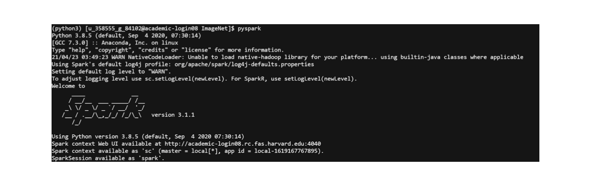

# Replicability

Replicability information. 


In order to reproduce our results and run our code, one first needs to connect to FAS On Demand. Them, in our team’s project location (cd /n/holyscratch01/Academic-cluster/Spring_2021/g_84102/SCRATCH/ImageNet/), which we rendered it public for everyone to see our code and be able to run the code.

Load the conda module with python >= 3.7 (otherwise the compatibility of tensorflow datasets 2.4 breaks the code):
```
module load python/3.8.5-fasrc01
```
Create a conda environment with the right packages:
```
conda create -n python3
source activate python3
pip install -r requirements.txt
```
Load Cuda and Cudnn:
```
module load cuda/11.0.3-fasrc01
module load cudnn/8.0.4.30_cuda11.0-fasrc01
```

Allocate a session with 4 GPUs, on the gpu partition, with 100GB and 10 hours:
```
salloc -t 600 --mem=100G -p gpu --exclusive --gres=gpu:4
```

Sanity check: one should be able to run python test_gpu.py and get as output

Install Spark:
Load java module:

```
module load jdk/1.8.0_45-fasrc01
```

Download Spark 3.1.1:
```
curl -O https://archive.apache.org/dist/spark/spark-3.1.1/spark-3.1.1-bin-hadoop3.2.tgz
tar xvf spark-3.1.1-bin-hadoop3.2.tgz
vim ~/.bashrc
```
Add the following lines: 

```
SPARK_HOME=/n/holyscratch01/Academic-cluster/Spring_2021/g_84102/SCRATCH/ImageNet/spark
export PATH=$PATH:$SPARK_HOME/bin:$SPARK_HOME/sbin
```
Check that it’s working:
```
pyspark
```
The output should look like this:




How to train the initial MobileNet on ImageNet: 
Create a wandb account in order to visualize training log: wandb.

Run the bash training script:
```
sbatch run_script.sh 
```

In order to check that the work if effectively being parallelized across the 4 GPUs, open a new shell (one needs to be in login mode)

```
squeue -u $USER
```

```
ssh to the node (here it is ssh aagk80gpu55)
nvidia-smi -l 1 (dynamic visualization of the occupation of the 4 GPUs)
```

The output should look like:

This output shows that the parallelization is successful, our bottleneck for the in the data pipeline with the CPU feeding the GPU has been resolved (we have now 90% util capacity of every 4 GPUs) and we are allocating the memory of the GPU in the right way since with every bus its memory its nearly saturated (we need to use batch size of $2^k$ so switching to the next batch size produces OOM error).


## Specs of the system

## Network specs

## Operating system

## Libraries

## Configuration instructions

