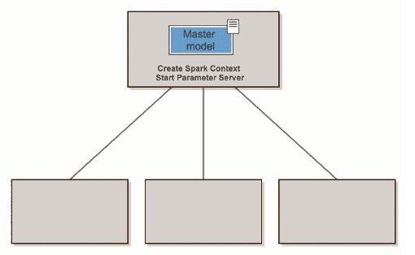
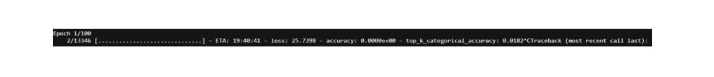
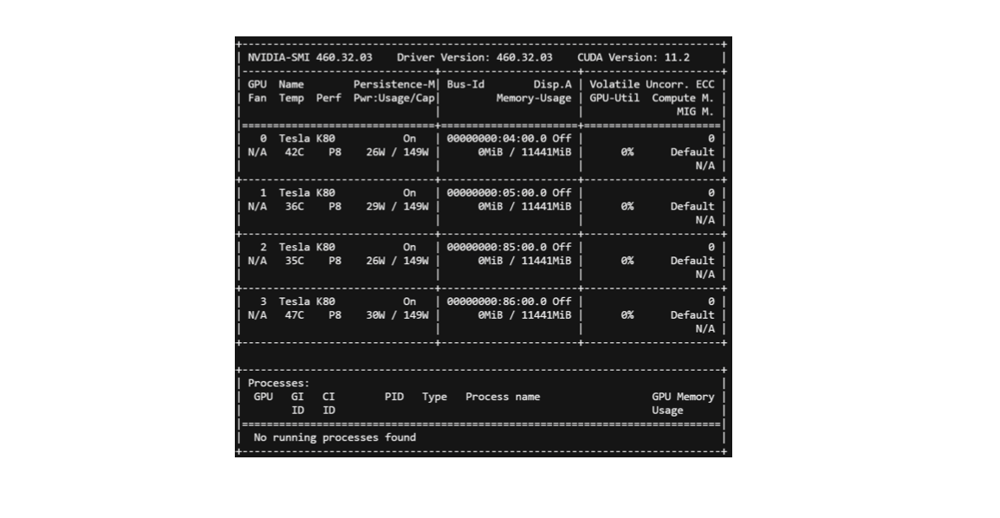
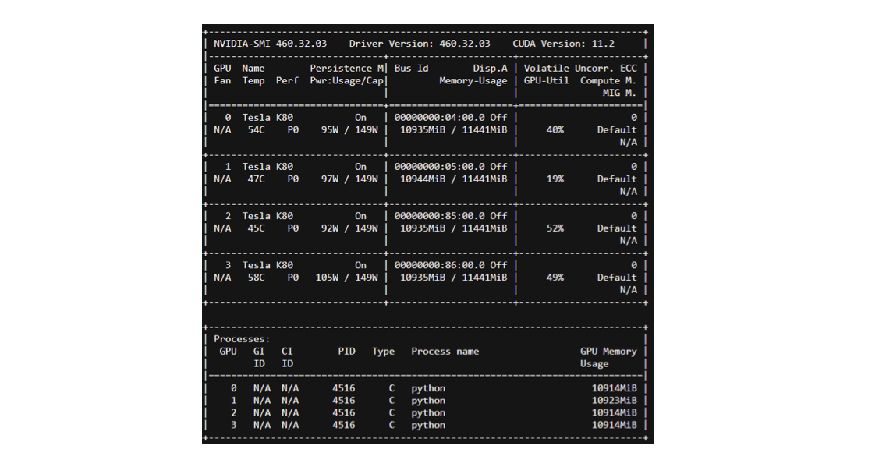
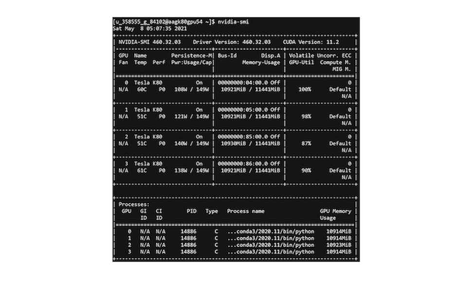
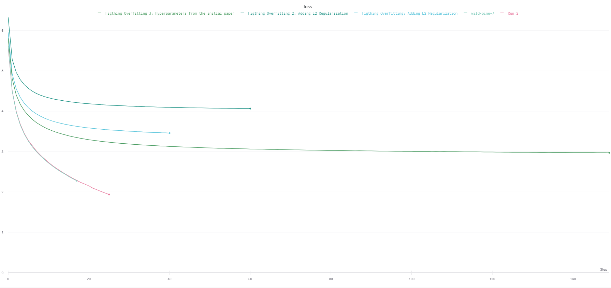
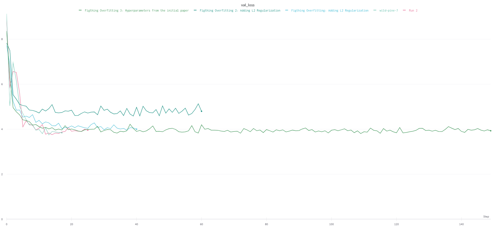
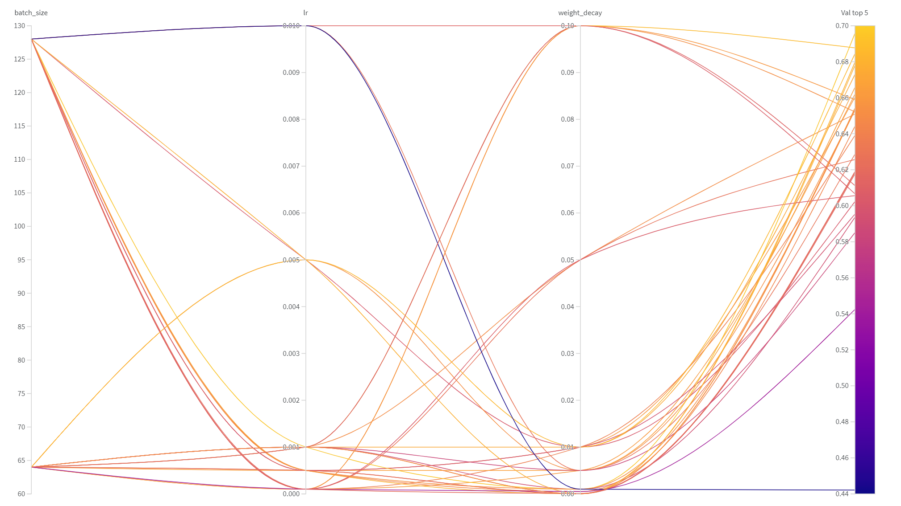
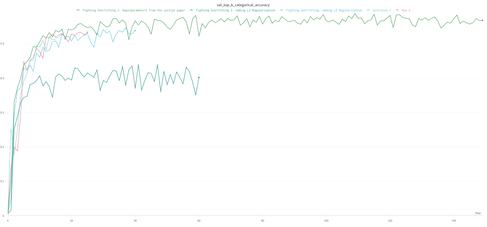
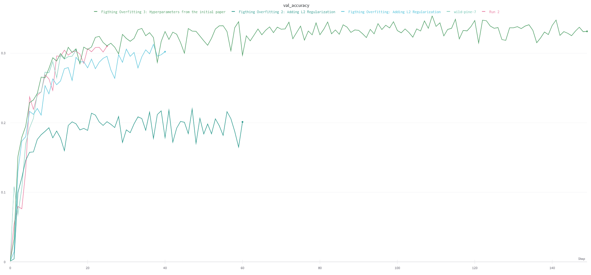

# Solution


## Type of application: Big Compute

**MobileNetV2 Architecture**: 
- Total number of parameters: 3.4M 
- Number of multiply-adds (MAdds) per forward pass: 300M
- **Solution**: GPU Accelerated Computing (4 GPUs single worker node)

**Two Nested For Loops to Find the Lottery Ticket Hypothesis**
- Outer for loop: iterate over different masks (pruning thresholds)
- Inner for loop: iterate over the range of late resetting epochs
- Train a sparse MobileNetV2 CNN per each inner loop iteration
- **Solution**: SLURM: Distributed Computing (20 worker nodes)

## Type of application: Big Data

ImageNet Dataset: 
- Total number of training images: 1.23M  
- Total number of validation images: 100k
- Total number of test images: 50k
- ImageNet Dataset size: 157.3 GB
- Average image resolution (downloaded): 469x387
- Average image resolution (preprocessed): 227x227
- **Solution**: PySpark API Dataflow Parallelization (download and process ImageNet)
- **Solution**: Performance Optimization (caching, prefetching)
- **Solution**: Keras Extension Elephas Data-parallel Training

## Programming model and infrastructure

Python 3.8.5, mpi4py 3.0.3, pyspark 3.1.1, Apache maven 3.8.1, java 1.8.0_45
We used Spark-Tensorflow connector and Standalone Spark mode to convert the data from TF Tensors to RDD and process it in an offline manner
We use SLURM Job Arrays for communication between our nodes and Python Multiprocessing for parallelization within a node 
Train using TensorFlow 2.0 (leveraging cuda and cudnn) 
Objective: End solution comprises 20 worker nodes, each one will have 4 GPUs TESLA K80 with 11.5 GB memory and 64 CPUs 


- We use FAS RC (take advantage of the SCRATCH space [300+GB] and the ease of allocating several nodes for MPI). 
- Python 3.8.5, mpi4py 3.0.3, pyspark 3.1.1
- We used Spark to download the data [working closely with FAS in order to devise the right SLURM allocations for the different workers to access the GPUs safely]


- We use MPI for communication between our nodes and Python Multiprocessing for parallelization within a node. We allocate jobs to different nodes and then on every node, we use Spark 
- Train using TensorFlow 2.0 (leveraging cuda and cudnn) and <a href="https://github.com/maxpumperla/elephas">Elephas</a> (PySpark module) in order to accelerate batch training 
- Objective: End solution comprises 20 worker nodes, each one will have 4 GPUs TESLA K80 with 11.5 GB memory and 64 CPUs 

### More about Elephas

<p align="justify"> Elephas implements a class of data-parallel algorithms on top of Keras, using Spark's RDDs and data frames. Keras Models are initialized on the driver, then serialized and shipped to workers, alongside with data and broadcasted model parameters. Spark workers deserialize the model, train their chunk of data and send their gradients back to the driver. The "master" model on the driver is updated by an optimizer, which takes gradients either synchronously or asynchronously. </p> 



In PySpark we provide Spark SQL data source API for loading image data as a DataFrame. Reference: https://spark.apache.org/docs/latest/ml-datasource.html 

## Profiling and training MobilenetV2


<p align="justify"> Empirically, for a batch size of 96,  we went down 20h per epoch on a single CPU, to  3h30 per epoch using one GPU, to 1h per epoch using 4 GPUs. The theoretical speed up of passing from one to four GPUs is 4, but the effective speed-up was 3.5 due to communication overhead between CPU and GPU. </p> 

<p align="justify"> But the preprocessing of our data meant the GPUs could not access the data efficiently so the GPU occupation was low. </p>

<p align="justify"> We went down to 15 min per epoch by preprocessing the data (GPU occupation: 50%). We could expect a 1X to 2X speed-up by further augmenting GPU occupation. </p>

### Summary

- Running on a single CPU: 20hrs/epoch
- Running on a single Tesla K80 GPU: 3h30/epoch
- Running on 4 Tesla K80 GPUs: 1h/epoch
- Identifying the bottleneck: slow data pipeline


## Main Overheads

### Communication: 

- Performance of GPU applications can be bottlenecked by data transfers between the CPU nodes and GPU. It limits the peak throughput that can be obtained from these memory spaces
- **Solution:** Caching & Prefetching in order to accelerate data transfers between CPU & GPU

### Data processing: 

- The CPU takes some time to feed the data to the GPU. 
- **Solution:** Parallelization of the data pipeline using 144 different workers
- **Solution:** Vectorization of the pipeline function using Batching
 
After parallelization of the data pipeline, down to 15 mins/epoch 
Next step to reach 100% GPU occupation: Offline processing of the data using Spark

Synchronization: We structured our architecture in order for different nodes to be independent

##### FAS RC

We used 20 nodes with 4 GPUs per node on FAS RC.

## CPU and GPU Training

We use the following link a resource to set up the train on multiple GPUs: https://towardsdatascience.com/train-a-neural-network-on-multi-gpu-with-tensorflow-42fa5f51b8af. 
```
tf.distribute.Strategy
```
is a TensorFlow API to distribute training across multiple GPU. We use the mirrored stratedy which send splits the batches and sends them to the four different GPUs.



We bring down the time with GPUs:


With 4 GPUs and a batch size of 96:


## GPU Occupancy

<p align="justify">  " A CUDA device's hardware implementation groups adjacent threads within a block into warps. A warp is active from the time its threads begin executing to the time when all threads in the warp have exited from the kernel. Occupancy is the ratio of active warps on an SM to the maximum number of active warps supported by the SM. Occupancy varies over time as warps begin and end, and can be different for each SM. " </p>

Source: https://docs.nvidia.com/gameworks/content/developertools/desktop/analysis/report/cudaexperiments/kernellevel/achievedoccupancy.htm

### Increasing the GPU Occupancy



<p align="justify">  We see that initially, the GPU occupancy is 0%. At this stage, the bottleneck of our architecture was the preprocessing, which prevented our GPUs from efficiently accessing the data. Besides, we couldn't do the batching before the mapping because of the inconsistencies of size in ImageNet. The first step we took to adress this issue was to transform the data to shapes of (64, 64). With image sizes of (64, 64), one epoch runs for 15 mins while for shapes of (224, 224) one epoch took 1h. Need to do some preprocessing here.After resolving the preprocessing issues, we manageed to increase the GPU occupancy: </p>



Finally, we were able to virtually reach 100% GPU occupancy.



## Spark for Offline Processing of the Data

We reshaped the data as tf tensors before loading it. 


## Training

- We save the weights at initialization. 
- We save the weights at the final step of training.
- We define a grid on the epochs for which we want to perform late resetting and save the weights during the training at every one of these epochs.

<p align="justify"> Once this is done, i.e. we have the initial & final values of the weights, as well as the values of the weights at the treillis of epochs, we can start IMP, we:

- Define a grid of thresholds on the magnitude of the final weights
- Compute the mask for every one of these thresholds in a loop
- For every masked network, retrain from every selected epoch (on a single node) in another loop
 
These two "for" loops are where the parallelization occurs.

## Initial training

### Training loss, validation loss, accuracy


Here is the training loss:


Here is the validation loss:


Here is the Top-5 accuracy (sweep). Top-5 accuracy means any of our model's top 5 highest probability answers match with the expected answer.







Those figures were obtained using wandb.

 
#### Weights exploration
 
To do this task we submit the different jobs using a bash file. We have 3538984 weights in our model. We studied the norms of the weights to decide on which thresholds to use for our masks.

- The minimum weight norm is 0.0
- The maximum weight norm is 2226.8171
- The mean weight norm is 0.14019392
- The 10 quantile is 0.0
- The 20 quantile is 0.0
- The 25 quantile is 4.926305977731582e-11
- The 30 quantile is 9.865087746696588e-10
- The 40 quantile is 0.007594366930425178
- The 50 quantile is 0.02179508749395609
- The 60 quantile is 0.03776561319828032
- The 65 quantile is 0.046586392819881445
- The 70 quantile is 0.056343686953186985
- The 75 quantile is 0.06743156351149082
- The 80 quantile is 0.08066952377557755
- The 81 quantile is 0.08369872085750103
- The 82 quantile is 0.08687067791819574
- The 83 quantile is 0.09022066660225392
- The 84 quantile is 0.0937917947769165
- The 85 quantile is 0.0976430837064981
- The 86 quantile is 0.10182715475559234
- The 87 quantile is 0.10635840006172656
- The 88 quantile is 0.11139745563268663
- The 89 quantile is 0.1169594067335129
- The 90 quantile is 0.1232308015227318
- The 91 quantile is 0.13055326133966447
- The 92 quantile is 0.13914283633232122
- The 93 quantile is 0.14968018367886543
- The 94 quantile is 0.163216772377491
- The 95 quantile is 0.18187121450901
- The 96 quantile is 0.2115161424875247
- The 97 quantile is 0.27592926561832376
- The 98 quantile is 0.6517226707935329
- The 99 quantile is 2.9455150127410867

For example, if we choose a threshold of 2.9455150127410867, our mask will mask all the weights whose norm is lower than 2.9455150127410867. Thus we will be left with a network that has only one percent of the original size.

We wanted to use 20 worker nodes. Thus we kept the 60, 65, 70, 75, 80, 85, ...., 99 quantiles. Those are saved in different files on the FAS cluster. The motivation is to have subnetworks that are much smaller than the originial network. 

## Training 
