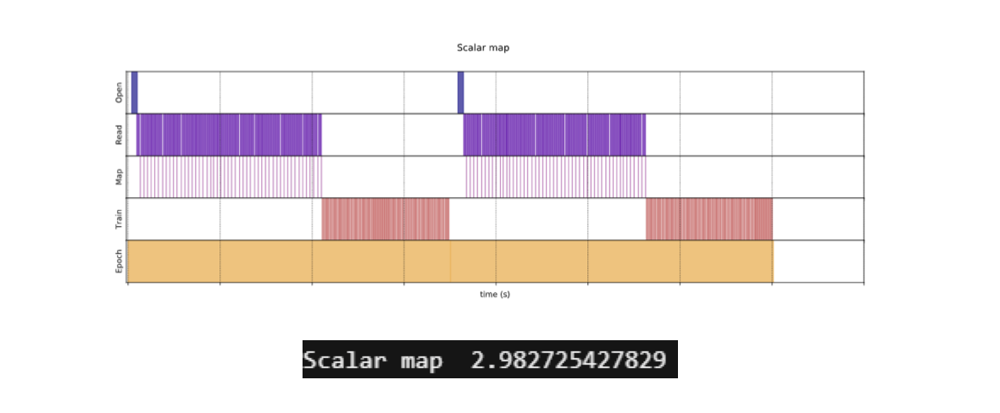
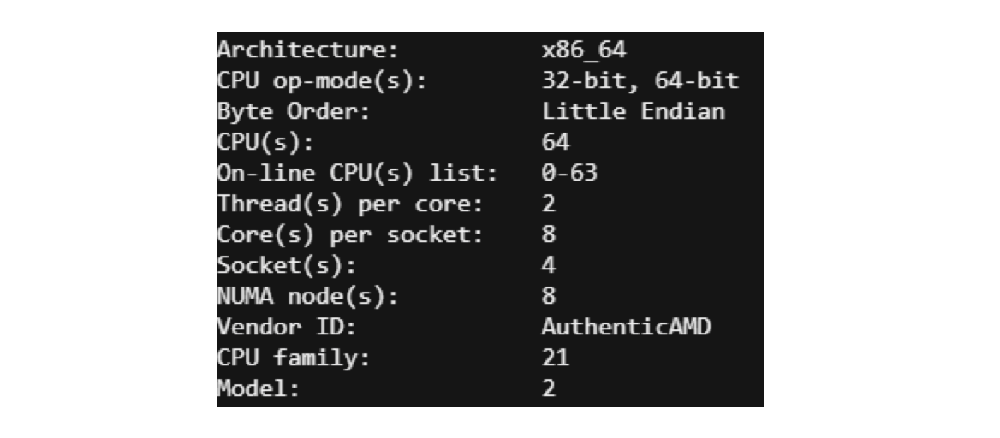
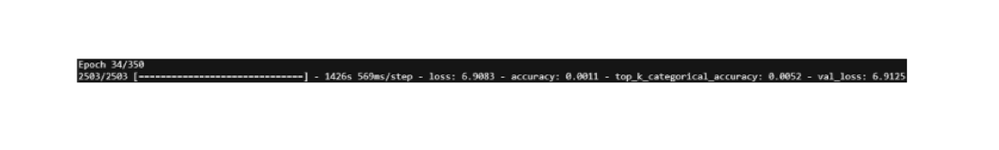
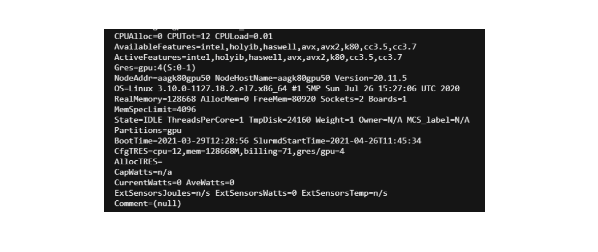
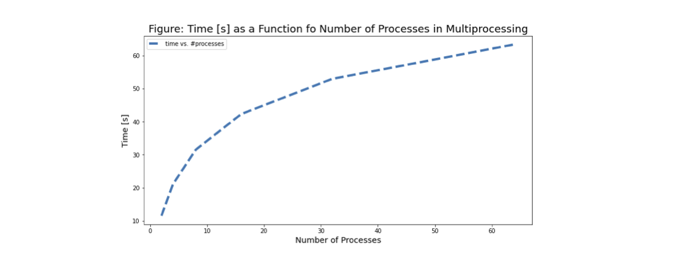
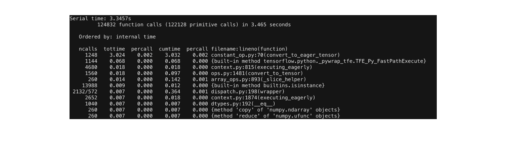
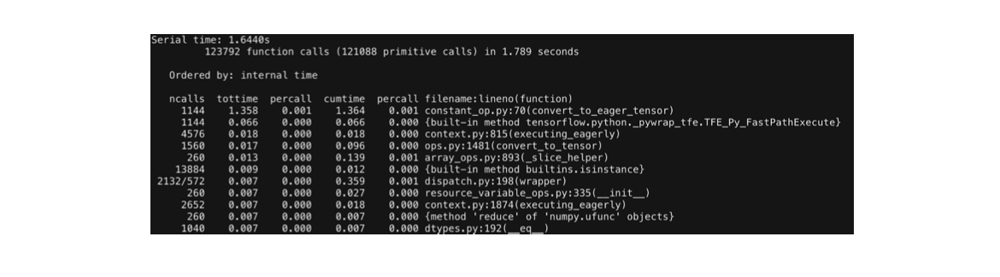

# Solution

We first present an overview of the challenges we faced. We then go into details about parallelizating the training of a CNN in section 2 and about parallelizing the masking procedure in section 3.

# Overview

## Programming model and infrastructure

- Python 3.8.5, mpi4py 3.0.3, pyspark 3.1.1, Apache maven 3.8.1, java 1.8.0_45
- We used Spark-Tensorflow connector and Standalone Spark mode to convert the
data from TF Tensors to RDD and process it in an offline manner
- We use SLURM Job Arrays for communication between our nodes and Python
Multiprocessing for parallelization within a node
- rain using TensorFlow 2.0 (leveraging cuda and cudnn)
- **Objective:** End solution comprises 20 worker nodes, each one will have 4 GPUs
TESLA K80 with 11.5 GB memory and 64 CPUs
 

## Profiling and training MobilenetV2


<p align="justify"> Empirically, for a batch size of 96,  we went down 20h per epoch on a single CPU, to  3h30 per epoch using one GPU, to 1h per epoch using 4 GPUs. The theoretical speed up of passing from one to four GPUs is 4, but the effective speed-up was 3.5 due to communication overheads between CPU and GPU. </p> 

<p align="justify"> However, at this point the preprocessing of our data meant the GPUs could not access the data efficiently so the GPU occupation was low. </p>

<p align="justify"> We went down to 15 min per epoch by preprocessing the data (GPU occupation: 50%). We could expect up to x2 speed-up by further augmenting GPU occupation. </p>

### Summary: after the project design presentation

- Running on a single CPU: 20hrs/epoch
- Running on a single Tesla K80 GPU: 3h30/epoch
- Running on 4 Tesla K80 GPUs: 1h/epoch
- **Identifying the bottleneck:** slow data pipeline


## Main Overheads

### Communication: 

- Performance of GPU applications can be bottlenecked by data transfers between the CPU and GPU. It limits the peak throughput that can be obtained from these memory spaces
- **Solution:** Caching & Prefetching in order to accelerate data transfers between CPU & GPU

### Data processing: 

- The CPU takes some time to feed the data to the GPU. 
- **Solution:** Parallelization of the data pipeline using 144 different workers
- **Solution:** Vectorization of the pipeline function using Batching




 
After parallelization of the data pipeline, down to 15 mins/epoch 

Next step to reach 100% GPU occupation: Offline processing of the data using Spark

Synchronization: We structured our architecture in order for different nodes to be independent

# Effective Parallelization of the Training of a CNN

## CPU and GPU Training

First, using the following architecture:



we learn hyperparameters and their influence on the training time:
- Batch size : arbitrary
- Learning Rate : arbitrary
- Number of Epochs : 100


We see that:
- 1 epoch = 20 hours
- 1 model = 100 epochs = 2000 hours
- 100 models = 200000 hours = ~8000 days

We bring down the time with GPUs:


- 1 epoch = 4 hours
- 1 model = 100 epochs = 400 hours
- 100 models = 40000 hours = ~1650 days

We then use the following link a resource to set up the training on multiple GPUs: https://towardsdatascience.com/train-a-neural-network-on-multi-gpu-with-tensorflow-42fa5f51b8af. 
```
tf.distribute.Strategy
```
is a TensorFlow API to distribute training across multiple GPU. We use the mirrored stratedy which send splits the batches and sends them to the four different GPUs.

We bring down the time further with 4 GPUs and a batch size of 96:


- 1 epoch = 1 hour
- 1 model = 100 epochs = 100 hours
- 100 models = 10000 hours = ~400 days

## GPU Occupancy

<p align="justify">  Let us start by defining GPU occupancy. Nvidia have agreat definition on their website: "A CUDA device's hardware implementation groups adjacent threads within a block into warps. A warp is active from the time its threads begin executing to the time when all threads in the warp have exited from the kernel. Occupancy is the ratio of active warps on an SM to the maximum number of active warps supported by the SM". </p>

Source: 
- https://docs.nvidia.com/gameworks/content/developertools/desktop/analysis/report/cudaexperiments/kernellevel/achievedoccupancy.htm

### Increasing the GPU Occupancy


<p align="justify">  We see that initially, the GPU occupancy is 0%. At this stage, the bottleneck of our architecture was the preprocessing, which prevented our GPUs from efficiently accessing the data. Besides, we couldn't do the batching before the mapping because of the inconsistencies of size in ImageNet. The first step we took to adress this issue was to transform the data to shapes of (64, 64). With image sizes of (64, 64), one epoch runs for 15 mins while for shapes of (224, 224) one epoch took 1h. After resolving the preprocessing issues, we manageed to increase the GPU occupancy: </p>


Now:



- 1 epoch = 23 minutes
- 1 model = 100 epochs = ~38 hours
- 100 models = ~150 days
- Can we reach ~100% GPU occupation ?


Issue: we can’t batch ImageNet because of non uniform shapes of Images
- Solution: offline preprocessing Step, using either TFDS pipeline or Spark
- Problems using Spark: the data is loaded as TF Records and not as .PNG files
- Solution: Use a Spark Tensorflow Connector in order to load the TF Records as Spark
DataFrames (requires using maven)
- Using Spark pipelining: process 1024 images in 12 seconds
- Using TFDS pipelining: process 1024 images in 38 seconds
- Effective Data processing Speed up using spark: ~3 x

Finally, we were able to virtually reach 100% GPU occupancy.


**Final results:**
- 1 epoch = 11 minutes
- 1 model = 100 epochs = ~18 hours
- 100 models = ~75 days
- Effective Speed-up from Single CPU: ~x100

## Spark for Offline Processing of the Data

We reshaped the data as tf tensors before loading it. 


## Training

- We save the weights at initialization. 
- We save the weights at the final step of training.
- We define a grid on the epochs for which we want to perform late resetting and save the weights during the training at every one of these epochs.

<p align="justify"> Once this is done, i.e. we have the initial & final values of the weights, as well as the values of the weights at the treillis of epochs, we can start IMP, we:

- Define a grid of thresholds on the magnitude of the final weights
- Compute the mask for every one of these thresholds in a loop
- For every masked network, retrain from every selected epoch (on a single node) in another loop
 
These two "for" loops are where the parallelization occurs.

## Initial training

### Training loss, validation loss, accuracy

<p align="justify"> Once we have been able to effectively parallelize our training accross 4 different GPUs, we were able to launch the initial training of the CNN. In order to get the best results possible, we used Hyper Parameter tuning launching different runs to different runs through SlURM arrays. The hyperparameter configuration was optimized using Bayesian Optimization using Weights & Biases sweeps (see https://docs.wandb.ai/guides/sweeps). </p>

Here are our training losses across different hyperparameter configurations:


Here is the validation loss:


<p align="justify"> Here is the result of our HyperParameter Optimization for MobileNet. As you can see, the results are a bit better than in our final runs because of the fact that we used a subset of the data in order to optimize over this subset. This subset was only composed of 100 classes, explaining why we got better results. We decided to optimize over a subset of the data in order to have results faster. </p>


Here is the Top-5 accuracy (sweep). Top-5 accuracy means any of our model's top 5 highest probability answers match with the expected answer.


Those figures were obtained using wandb.

 
### Weights exploration

<p align="justify"> Once the initial training was done, we needed to select different thresholds to apply on the weights in order to perform the masking step of IMP. In order to do that, we had to explore the different weights of the model and decide based on the weights percentiles. </p>

<p align="justify"> To do this task we submit the different jobs using a bash file. We have 3538984 weights in our model. We studied the norms of the weights to decide on which thresholds to use for our masks. </p>

- The minimum weight norm is 0.0
- The maximum weight norm is 2226.8171
- The mean weight norm is 0.14019392
- The 10 quantile is 0.0
- The 20 quantile is 0.0
- The 25 quantile is 4.926305977731582e-11
- The 30 quantile is 9.865087746696588e-10
- The 40 quantile is 0.007594366930425178
- The 50 quantile is 0.02179508749395609
- The 60 quantile is 0.03776561319828032
- The 65 quantile is 0.046586392819881445
- The 70 quantile is 0.056343686953186985
- The 75 quantile is 0.06743156351149082
- The 80 quantile is 0.08066952377557755
- The 81 quantile is 0.08369872085750103
- The 82 quantile is 0.08687067791819574
- The 83 quantile is 0.09022066660225392
- The 84 quantile is 0.0937917947769165
- The 85 quantile is 0.0976430837064981
- The 86 quantile is 0.10182715475559234
- The 87 quantile is 0.10635840006172656
- The 88 quantile is 0.11139745563268663
- The 89 quantile is 0.1169594067335129
- The 90 quantile is 0.1232308015227318
- The 91 quantile is 0.13055326133966447
- The 92 quantile is 0.13914283633232122
- The 93 quantile is 0.14968018367886543
- The 94 quantile is 0.163216772377491
- The 95 quantile is 0.18187121450901
- The 96 quantile is 0.2115161424875247
- The 97 quantile is 0.27592926561832376
- The 98 quantile is 0.6517226707935329
- The 99 quantile is 2.9455150127410867

For example, if we choose a threshold of 2.9455150127410867, our mask will mask all the weights whose norm is lower than 2.9455150127410867. Thus we will be left with a network that has only one percent of the original size.

We wanted to use 20 worker nodes. Thus we kept the 60, 65, 70, 75, 80, 85, ...., 99 quantiles. Those are saved in different files on the FAS cluster. The motivation is to have subnetworks that are much smaller than the originial network. 

# Effective Parallelization of Masking: Distributed Memory Parallel Programming

## From MPI to SLURM

**Issue: Distributed Memory Parallel Computing Paradigm involves some overheads in the communication between different nodes**
- Solution: Transform our problem into a SIMD paradigm and use SLURM Job arrays in order to parallelize the work without communication.
- Setting: We parallelized over 20 workers nodes (two cascades of 10 worker nodes with 4 GPUs)



##  Single Process vs Multiprocessing

**Pruning the MobileNet architecture using Tensorflow**

- Issue: pruning weights using a mask in tensorflow damages the computational graph
- Solution: zeroing the weights using a mask on each batch using tf.callbacks

**Code Profiling**
- Results from code profiling
    - Tf.callbacks: 3.3457s
    - Total batch time (including tf.callbacks): 3.5970s
    - Tf.callbacks: ~93% of batch runtime
-  Issue: the influence of tf.callbacks on the training time



Optimizing the tf.callbacks 
- Single Process
    - Tf.callbacks on a single process: 3.3457s 
- Multiprocessing  
    - Tf.callbacks on 64 processes: 63.3417s
 
Why is multiprocessing (MP) slowing down our code?
- Computation time increase with # processes
- Calling os.fork() at least 64 times!
     - Creating a child process expensive (overhead)
     - the number of trainable layers 155: ~ 3 tasks per process
     - Tasks simple: matrix multiplication
     - Overheads MP >> benefits MP

Conclusion: MP not a suitable solution for problem

## Within node code optimization

Optimizing the tf.callbacks on a single process:



- Issue: convert_to_eager_tensor ~90%
- Solution: convert_to_eager_tensor of mask outside the tf.callbacks
- Result: reduced tf.callbacks runtime by ~50%



## Results

- Training a Single CNN on 4 GPUs: 
    - Serial CPU Timing: 2000 hours
    - Parallel result: 18 hours
- Parallelization of the masking procedure over 10 nodes in a cascade
    - Serial result: 18h*100 = ~75 days
    - Parallel result: 18h*2*5 = ~15 days (shootout to Raminder & Francesco who gave us special privileges to allocate all the nodes at once)
- Total Training time (taking into account Late Resetting and Masking):
    - Fully Serial: ~ 8000 days
    - Parallelization of our solution: ~15 days
- Final speed up from single CPU to end-to-end solution: x500
